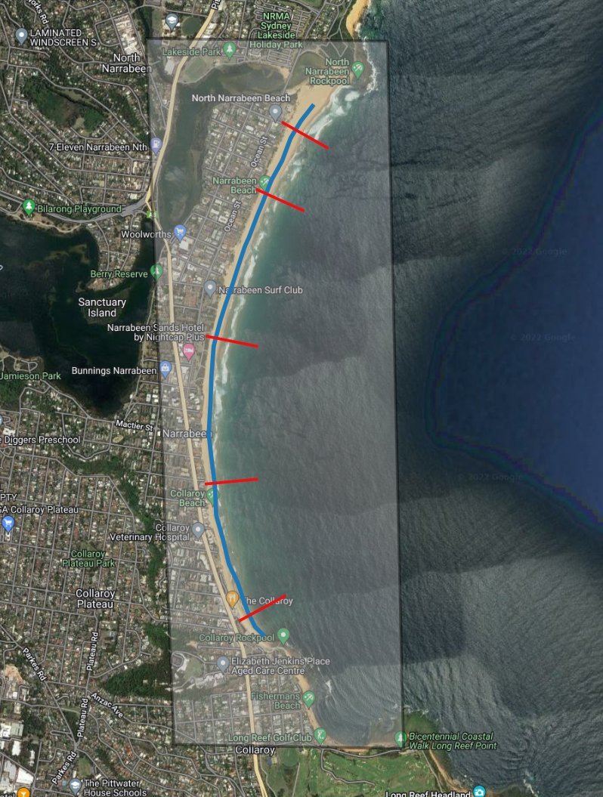
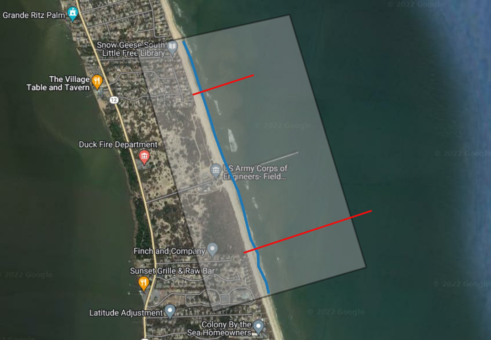
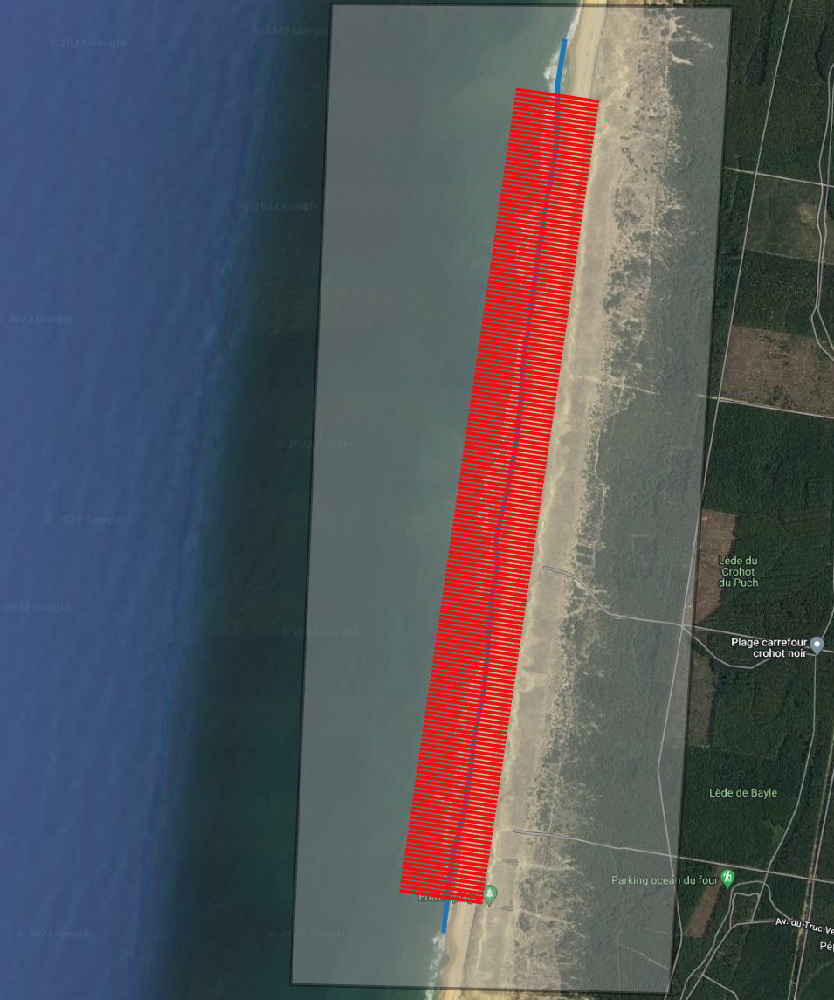
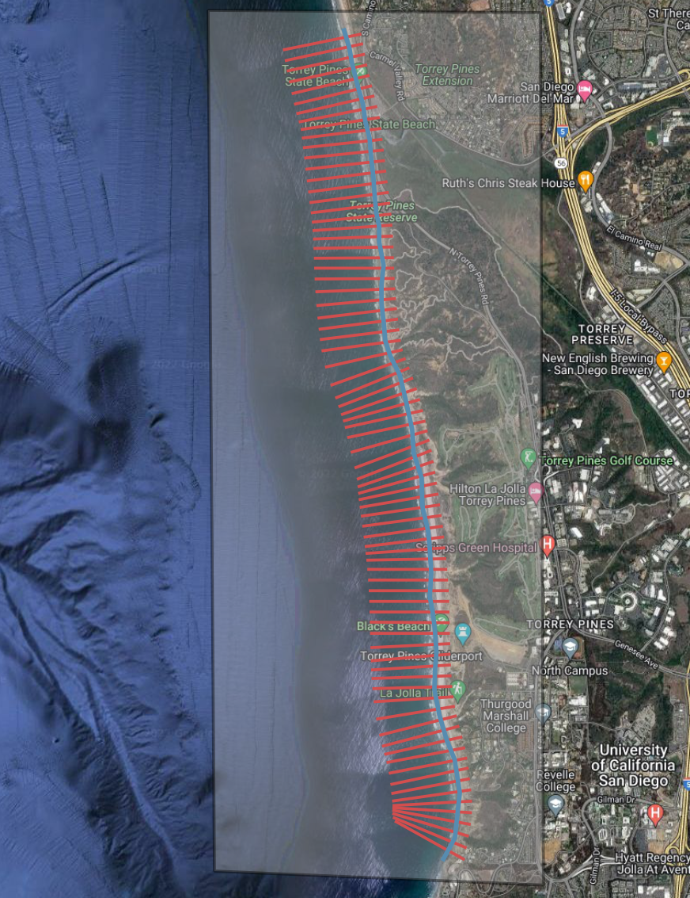

# SDS_Benchmark

This repository is a testbed for shoreline mapping algorithms using satellite imagery. It contains all benchmark datasets, input files, and codes to evaluate shoreline mapping algorithms.

## Background and Objectives

Different algorithms can be used to map the position of the shoreline on satellite imagery like Landsat and Sentinel-2, and extract long-term time-series of coastal change. Satellite-derived shoreline workflows differ on many aspects including:
1. the way images are  pre-processed (pan-sharpening, compositing, co-registration)
2. the spectral indices used for detecting the water edge (NDWI, MNDWI, AWEI)
3. the contouring method (at-pixel scale, sub-pixel, hard/soft classification)
4.  the water level correction that is applied to the shorelines (tide, beach slope, wave setup)

With this project, we want to showcase the diversity of algorithms that can be applied to the satellite imagery and create a platform that can be used to:  
- evaluate the accuracy of established satellite-derived shoreline (SDS) algorithms against benchmark datasets with a set methodology.
- test new algorithms, future developments and enhancements of existing SDS workflows.

## Input data

Participants can run their shoreline mapping algorithm at each of the sites using the input files provided.

Everybody is welcome to submit new benchmark datasets, or complement the existing ones, as long as the data they upload is publicly available.

Currently there are 4 validation sites available, which are downloaded from their respective sources and processed into time-series of shoreline change along cross-shore transects:
1. Narrabeen, Australia [ref](https://www.nature.com/articles/sdata201624)
2. Duck, North Carolina, USA [ref](https://agupubs.onlinelibrary.wiley.com/doi/abs/10.1002/2014JC010329)
3. Truc Vert, France [ref](https://www.nature.com/articles/s41597-020-00750-5#Tab2)
4. Torrey Pines, California, USA [ref](https://www.nature.com/articles/s41597-019-0167-6)

The first Jupyter notebook, [1_preprocess_datasets.ipynb](https://github.com/kvos/SDS_Benchmark/blob/main/1_preprocess_datasets.ipynb), provides the code to download and process the publicly available shoreline datasets into time-series of shoreline change along cross-shore transects. Everyone is encouraged to run this notebook to get familiar with the benchmark sites.

The following inputs are provided for each site:
- `Region of Interest (ROI)`: to download/crop the satellite imagery
- `Cross-shore transects`: to extract time-series of cross-shore shoreline change and apply a water level correct
- `Modelled tides`: time-series of tide levels every 5 min from the FES2014 global tide model
- `Beach slopes`: estimated from the topographic surveys, can be used to apply a water level correction
- (`Wave parameters`): not available at the moment but can be obtained if needed

The geospatial layers can be visualised by opening the QGIS file `qgis_overview.qgz` include in the repository.

Please use these inputs to ensure that differences between algorithms are not a result of differences in the inputs.

## Outputs and Deliverables

The time-series of shoreline change should be submitted for each transect in a consistent format to make the evaluation easier.

The `submission` folder will contain the shoreline change time-series from the different participating teams. An example of submission is provided in the `example_submission` folder. There is one folder per site and in that folder the shoreline time-series are separated in two subfolders:
- `raw_timeseries`: contains the raw time-series of shoreline change along the transects, as extracted from the images (no water level correction).
- `tidally_timeseries`: contains the tidally-corrected shoreline change time-series along the transects (can also include a wave correction).

**The format of the time-series is one .csv file per transect**, named with the following convention `PROFILENAME_timeseries_raw.csv` and `PROFILENAME_timeseries_tidally_corrected.csv` where:
- the first column contains the date in UTC time
- the second column contains the cross-shore distance of the shoreline from the origin of the transect
- the third column is optional and contains the name of the satellite mission from which the datapoint was extracted

An example of csv file is provided for Narrabeen under `/submissions/example_submission/NARRABEEN`.

#### How to submit

To submit your results, please:

1. [fork](https://github.com/SatelliteShorelines/SDS_Benchmark/fork) this repository;
2. Copy the `submission_example` folder and rename (e.g., 'team_CoastSat');
3. Change the files in the folder;
4. Create a [Pull request](https://docs.github.com/en/pull-requests/collaborating-with-pull-requests/proposing-changes-to-your-work-with-pull-requests/creating-a-pull-request-from-a-fork) to the original repository to submit your results.

If you need any help with this submission, please post in the [GitHub Issues](https://github.com/SatelliteShorelines/SDS_Benchmark/issues) page.

### Deadline

The deadline for this first round of analysis is the end of the year (**31/12/2022**).

## Benchmark datasets

### Site 1: Narrabeen, Australia, WRL dataset

### Site 2: Duck, North Carolina, FRF dataset

### Site 3: Truc Vert, France, METHYS dataset

### Site 4: Torrey Pines, California, Scripps dataset

## Questions and Comments

Please put any questions on the [GitHub Issues](https://github.com/SatelliteShorelines/SDS_Benchmark/issues) page so that everybody can read/comment.

## Acknowledgements

We acknowledge the creators of this repository which was used as a template: https://github.com/gwmodeling/challenge
