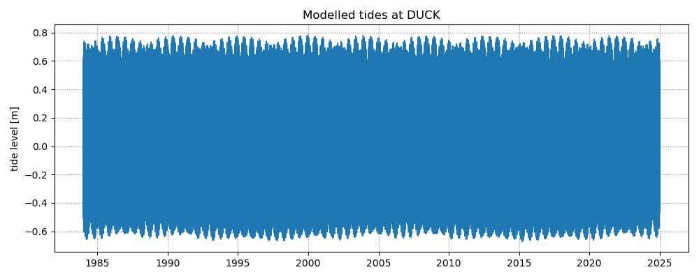

## Duck, North Carolina, FRF dataset

This dataset is publicly available in the [FRF Data Portal](https://frfdataportal.erdc.dren.mil/) and was processed as described in the Jupyter Notebook [`1_preprocess_datasets.ipynb`](https://github.com/SatelliteShorelines/SDS_Benchmark/blob/main/1_preprocess_datasets.ipynb).

The inputs for this site are provided in this folder:
- Region of Interest (ROI): `DUCK_polygon.geojson` in WGS84 (epsg:4326)
- Reference shoreline: `DUCK_reference_shoreline.geojson` in WGS84 (epsg:4326)
- Transect coordinates: `DUCK_transects.geojson`  in WGS84 (epsg:4326)

It is recommended to use `epsg:32119` as a local projected coordinate system.

The time-series of shoreline change were extracted from in situ surveys for the 0.4 m NAVD88 contour (equivalent to MHW):

Additional information to perform a tidal correction is also provided:
- Beach-face slope: use $tan\beta = 0.1$
- Modelled tide levels: `DUCK_tides.csv` dates in UTC time and tide levels in metres Above Mean Sea Level

More info about this site is located in the `sites_info.txt` file in the folder above.
