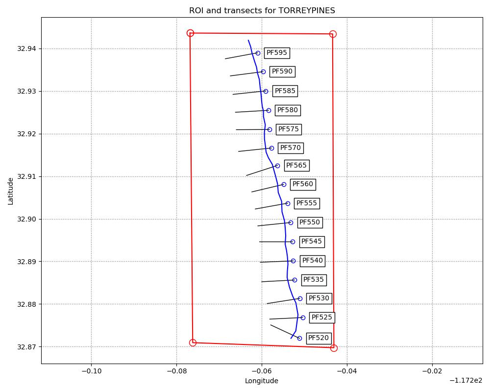
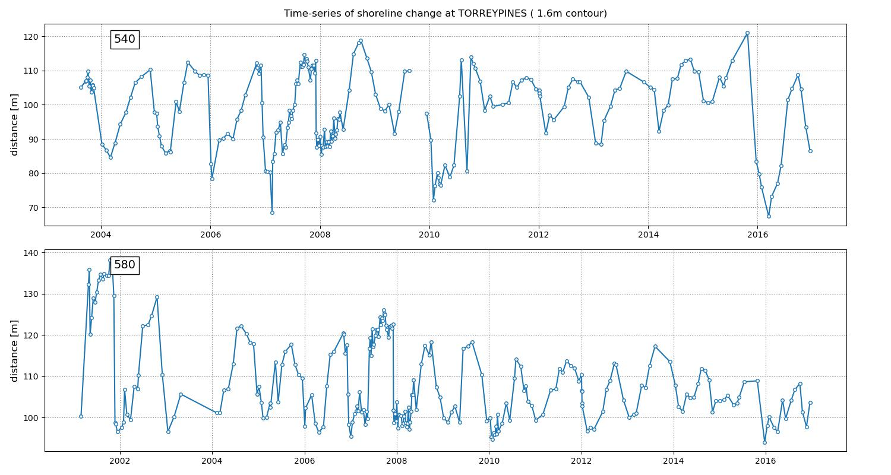
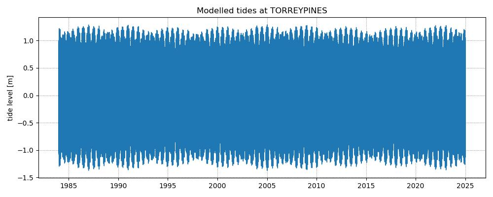
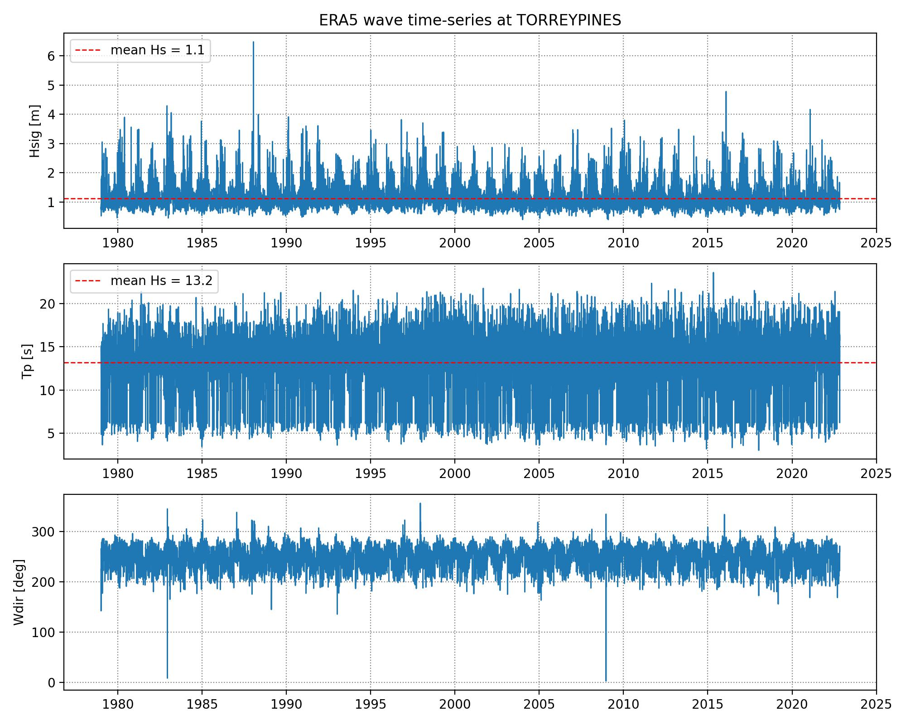

## Torrey Pines, California, Scripps dataset

This dataset is publicly available in the [Dryad repository](https://datadryad.org/stash/dataset/doi:10.5061/dryad.n5qb383) and was processed as described in the Jupyter Notebook [`1_preprocess_datasets.ipynb`](https://github.com/SatelliteShorelines/SDS_Benchmark/blob/main/1_preprocess_datasets.ipynb).

The inputs for this site are provided in this folder:
- Region of Interest (ROI): `TORREYPINES_polygon.geojson` in WGS84 (epsg:4326)
- Reference shoreline: `TORREYPINES_reference_shoreline.geojson` in WGS84 (epsg:4326)
- Transect coordinates: `TORREYPINES_transects.geojson`  in WGS84 (epsg:4326)

It is recommended to use `epsg:26946` as a local projected coordinate system.

The time-series of shoreline change were extracted from in situ surveys for the 1.566 m NAVD88 contour (equivalent to MHHW, and 0.792 m AMSL):

Additional information to perform a tidal/wave correction is also provided:
- Beach-face slope: use $tan\beta = 0.035$
- Modelled tide levels: `TORREYPINES_tides.csv` dates in UTC time and tide levels in metres Above Mean Sea Level
- Hindcast wave parameters: `TORREYPINES_waves_ERA5.csv` dates in UTC time and wave parameters are from ERA5 reanalysis.

More info about this site is located in the `sites_info.txt` file in the folder above.
