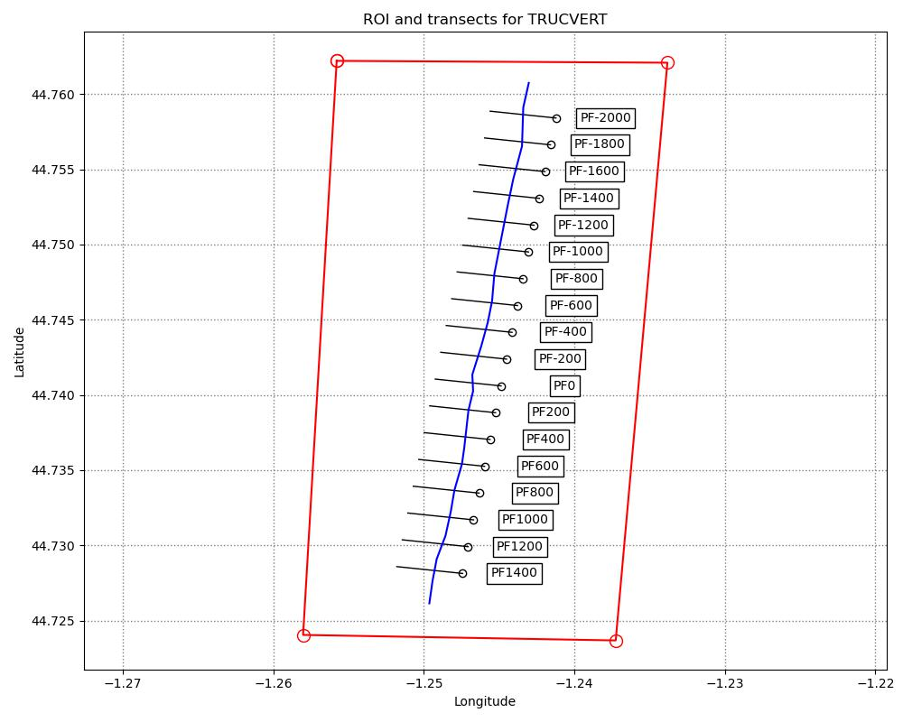
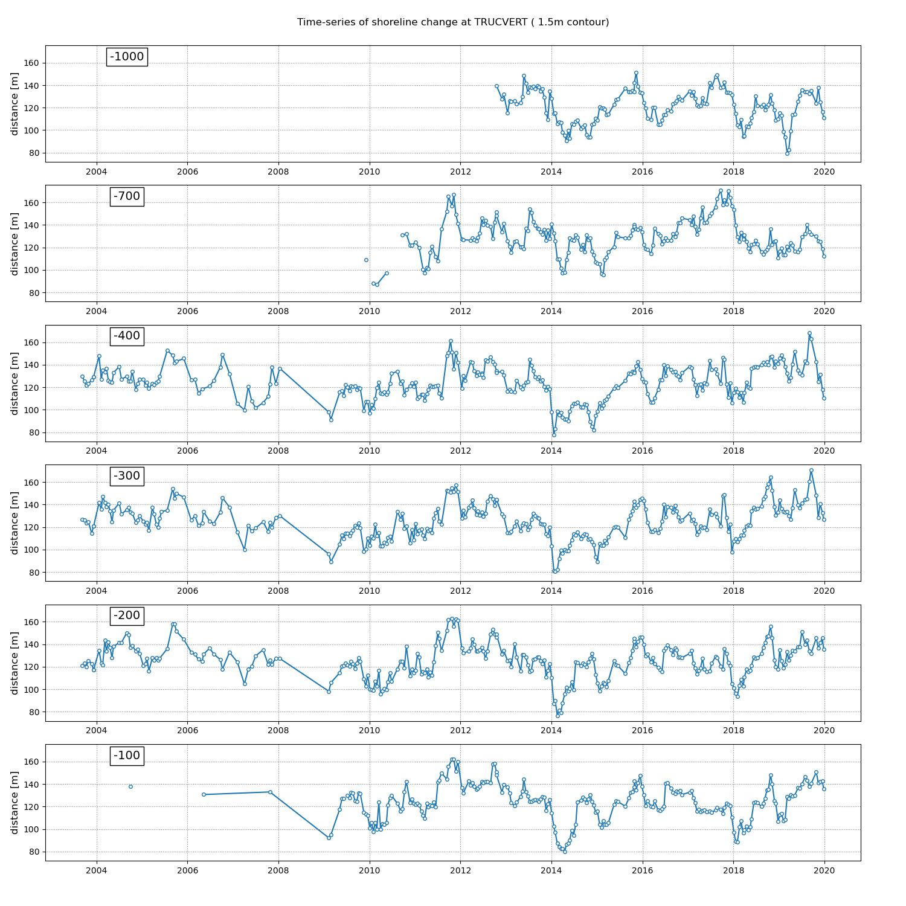
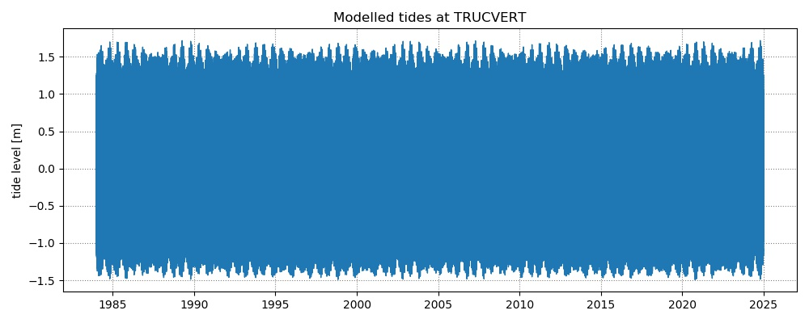

## Truc Vert, France, METHYS dataset

This dataset is publicly available in the [Open Science data repository](https://osf.io/jftw8/) and was processed as described in the Jupyter Notebook [`1_preprocess_datasets.ipynb`](https://github.com/SatelliteShorelines/SDS_Benchmark/blob/main/1_preprocess_datasets.ipynb).

The inputs for this site are provided in this folder:
- Region of Interest (ROI): `TRUCVERT_polygon.geojson` in WGS84 (epsg:4326)
- Reference shoreline: `TRUCVERT_reference_shoreline.geojson` in WGS84 (epsg:4326)
- Transect coordinates: `TRUCVERT_transects.geojson`  in WGS84 (epsg:4326)

It is recommended to use `epsg:32630` as a local projected coordinate system.

The time-series of shoreline change were extracted from in situ surveys for the 1 m AMSL contour:

Additional information to perform a tidal correction is also provided:
- Beach-face slope: use $tan\beta = 0.05$
- Modelled tide levels: `NARRABEEN_tides.csv` dates in UTC time and tide levels in metres Above Mean Sea Level

More info about this site is located in the `sites_info.txt` file in the folder above.
