# CoastSat submission

This submission was produced with the [CoastSat toolbox](https://github.com/kvos/CoastSat) in fully automatic mode at the benchmark sites.

## Author(s)

- Kilian Vos (UNSW Water Research Laboratory)

## Mapped locations

We produced shoreline time-series for the following locations (check locations):

- [x] NARRABEEN
- [x] DUCK
- [x] TRUCVERT
- [x] TORREYPINES

## Algorithm/workflow description

The algorithm used is CoastSat, which is open-source and available at https://github.com/kvos/CoastSat.

The outputs can be reproduced by running the Jupyter Notebook included in the `algorithms` section [COASTSAT_extract_shorelines](https://github.com/SatelliteShorelines/SDS_Benchmark/blob/main/algorithms/COASTSAT/COASTSAT_extract_shorelines.ipynb).

The CoastSat methodology is described in detail in [Vos et al. 2019a](https://www.sciencedirect.com/science/article/pii/S0378383918305313?via%3Dihub) and [Vos et al. 2019b](https://www.sciencedirect.com/science/article/pii/S1364815219300490?via%3Dihub#ec-research-data). The algorithm uses Google Earth Engine to crop and download the satellite imagery from the Landsat and Sentinel-2 archives. No co-registration is applied to the images. The image is first classified into 'water', 'sand',  'whitewater' and 'other' pixels. The shoreline is then mapped on individual images by contouring on the MNDWI the value corresponding to the Otsu threshold between the 'sand' and 'water' pixel distributions.

## Workflow to reproduce

The outputs can be reproduced by running the Jupyter Notebook included in the `algorithms` section [COASTSAT_extract_shorelines](https://github.com/SatelliteShorelines/SDS_Benchmark/blob/main/algorithms/COASTSAT/COASTSAT_extract_shorelines.ipynb).

## Estimation of effort

Please provide an (rough) estimate of the time it took to run the workflow (e.g., download, read in data, process). If possible, please also state the computational resources that were required.

| Location    | Download time (mins) | Mapping time (mins) | Total time (hrs) |
|-------------|------------------------|----------------------|------------------|
| NARRABEEN   | 120 | 10 | 02:10 |
| DUCK        | 60  | 10 | 01:10 |
| TRUCVERT    | 90  | 10 | 01:40 |
| TORREYPINES | 150 | 20 | 02:50 |

## Additional information

The results are provided for each site as `raw shoreline timeseries` and `tidally-corrected shoreline timeseries` (using FES2014 modelled tides).

More information about the shoreline mapping at each site is shown below:
#### NARRABEEN
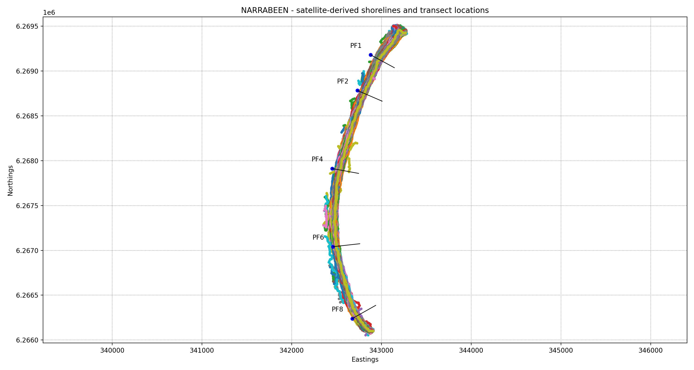
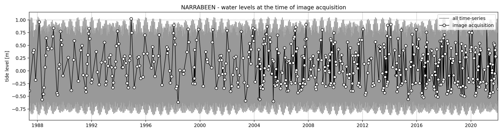
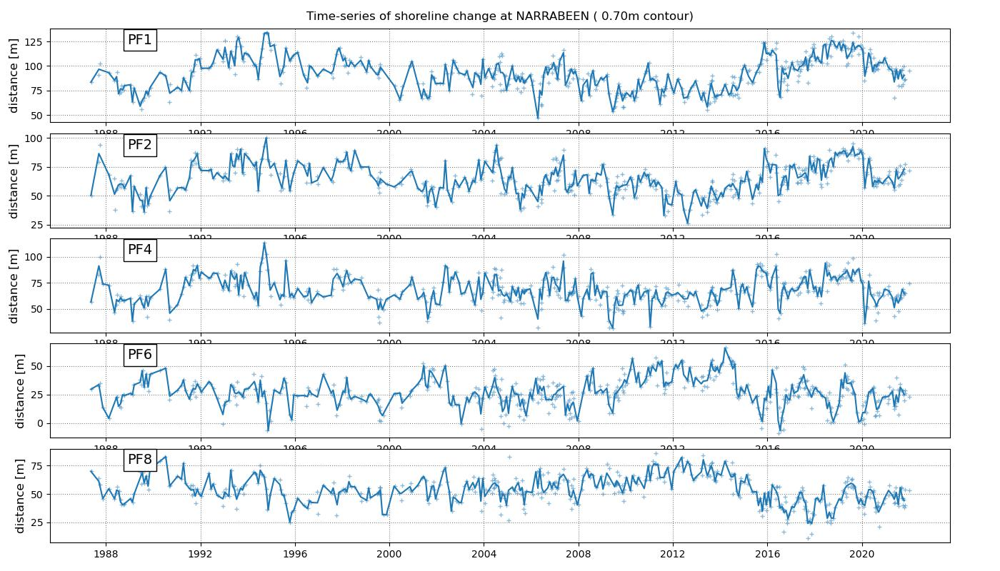
#### DUCK
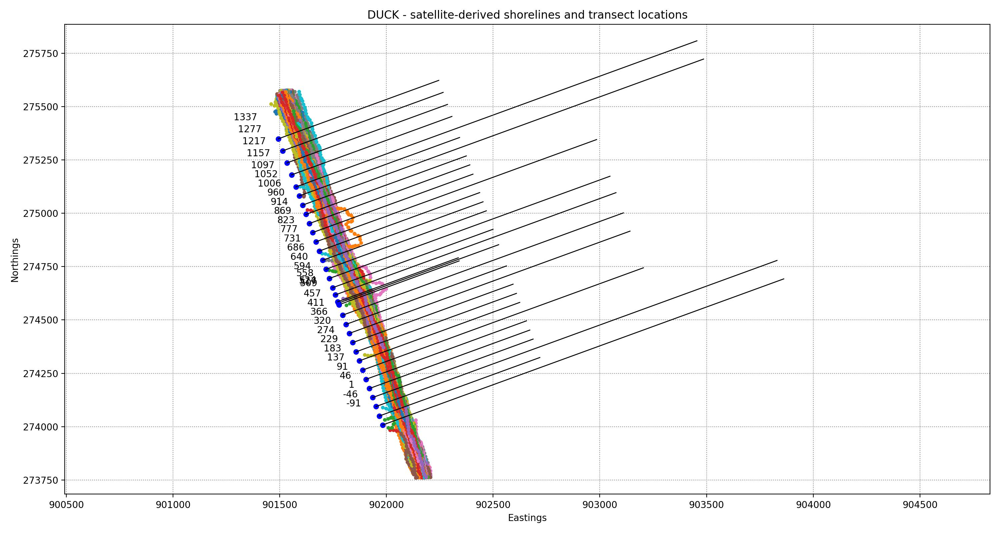
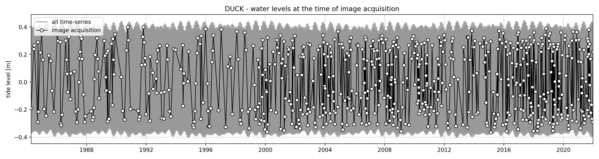
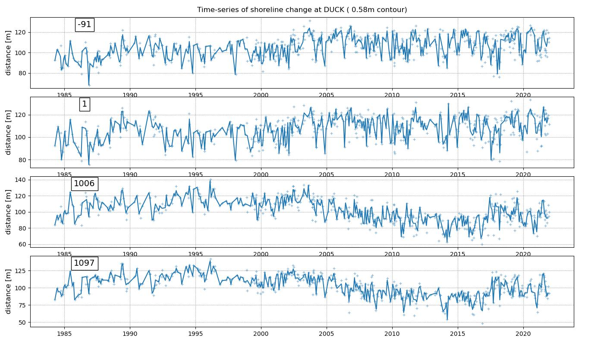
#### TRUCVERT
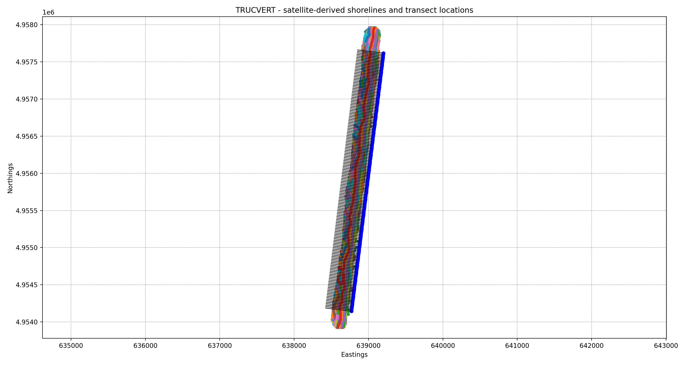
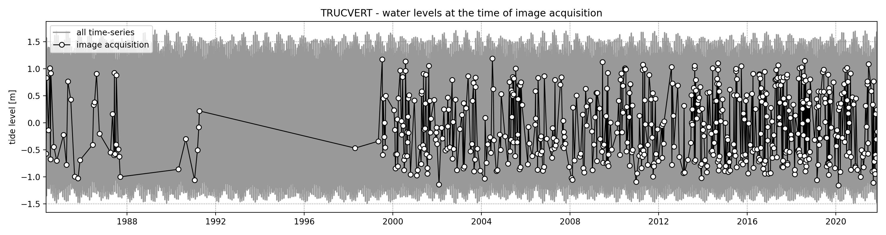
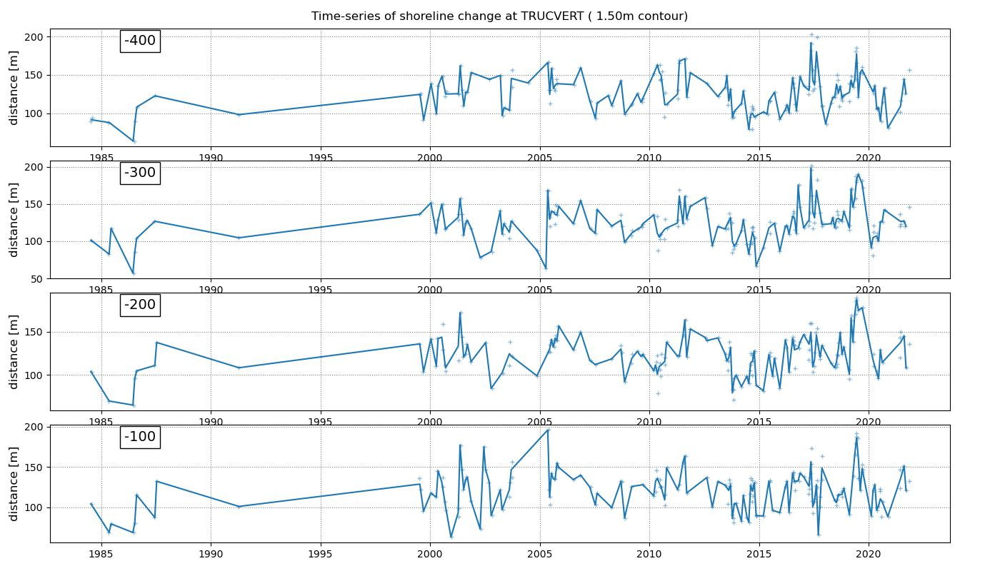
#### TORREYPINES
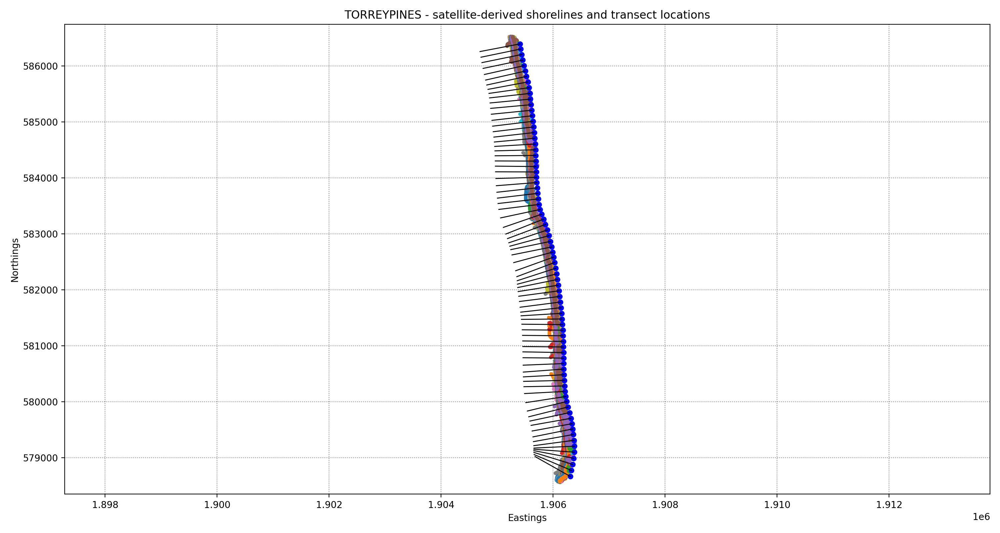
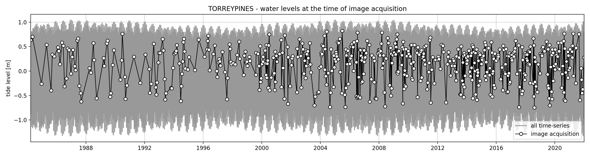
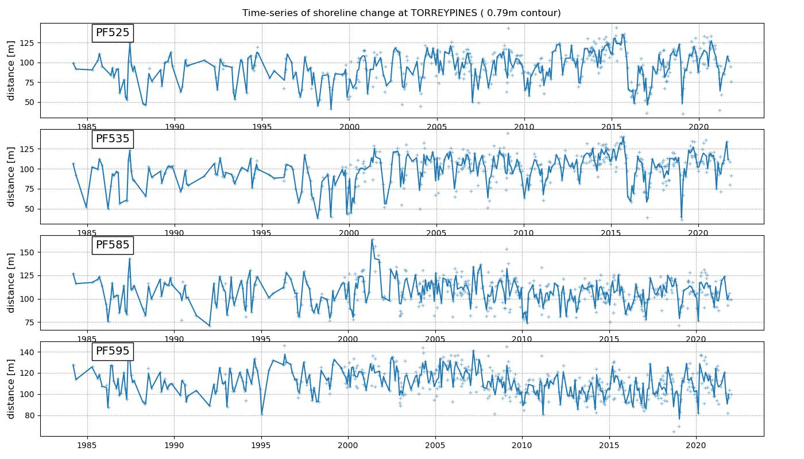
